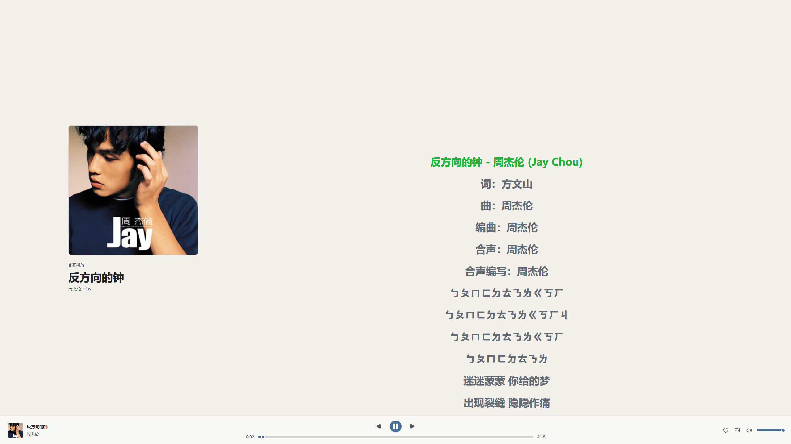

<p align="center">
  
</p>

<h1 align="center">XyMusic</h1>

<p align="center">
  面向个人音乐库的开源云音乐服务
</p>

<p align="center">
  <a href="./docs/example.md">界面预览</a> ·
  <a href="./docs/教程.md">部署教程</a>
</p>

XyMusic 用来集中管理和播放自己的音乐收藏。它可以扫描本地音乐目录并读取音源基础信息，通过管理后台批量整理曲目、专辑、艺术家、封面和歌词等信息；播放时再根据客户端能力即时转码。

项目包含完整的服务端、Web 管理后台、Windows 客户端和 Android 客户端，适合部署在个人服务器、NAS 或其他长期在线的设备上。

> 项目仍在持续开发中，功能与部署方式可能随版本调整。建议在升级或批量修改音乐元数据前做好备份。

## 主要功能

- **音乐库管理**：扫描本地目录，统一管理曲目、专辑与艺术家。
- **播放转码**：扫描阶段只读取音源基础信息，播放时使用 FFmpeg 按客户端能力即时生成临时音频。
- **元数据整理**：支持单曲或批量编辑，以及从多个来源刮削标签、封面和歌词。
- **标签回写**：读写音源可将整理后的元数据写回源文件。
- **后台管理**：管理用户、音源、扫描任务、Tag 写回任务和系统设置。
- **日常播放**：支持搜索、收藏、播放历史、歌单和随机播放等常用功能。
- **多端使用**：提供 Windows 和 Android 客户端，共用同一套云端音乐库。

## 快速部署

目前提供适用于 Linux AMD64 与 systemd 环境的一键安装脚本：

```bash
curl -fsSL https://github.com/muchenspace/XyMusic/raw/main/install.sh | sudo bash
```

安装完成后，访问：

```text
http://服务器地址:3000
```


一键安装脚本会将程序安装到 `/opt/xymusic`，注册为 systemd 服务并设置为开机启动。执行前请确认服务器已安装 `curl` 和 `unzip`。

## 使用流程

1. 在管理后台添加音乐音源并开始扫描。
2. 扫描自动探测音频元数据与侧车歌词。
3. 按需批量刮削或手动调整歌曲元数据。
4. 在客户端填写服务端地址并登录。
5. 开始浏览和播放自己的音乐库。

如果音源设置为读写模式，整理后的标签还可以回写到原始音乐文件；只希望 XyMusic 读取文件时，选择只读模式即可。

## 界面预览

完整页面与客户端效果可以在[界面预览](./docs/example.md)中查看。

<p align="center">
  
</p>

## 项目组成

| 模块 | 主要技术 | 说明 |
| --- | --- | --- |
| 服务端 | Go、Gin、PostgreSQL、FFmpeg | 提供 API、音乐库管理、本地资产存储与动态即时转码能力 |
| 管理后台 | Vue 3、TypeScript、Pinia、Vite | 负责首次配置、音乐库维护和系统管理 |
| Windows 客户端 | Tauri 2、Rust、Vue 3、TypeScript | Windows 桌面播放、系统媒体控制、桌面歌词与托盘后台播放 |
| Android 客户端 | Kotlin、Jetpack Compose、Media3 | Android 原生音乐客户端 |

仓库目录如下：

```text
XyMusic/
├── Server/
│   ├── Backend/               # Go 服务端
│   └── AdminWeb/              # Web 管理后台
├── Client/
│   ├── XyMusicForWin/         # Windows 客户端
│   └── XyMusicForAndroid/     # Android 客户端
├── docs/                      # 部署说明与界面截图
└── install.sh                 # Linux 一键安装脚本
```
