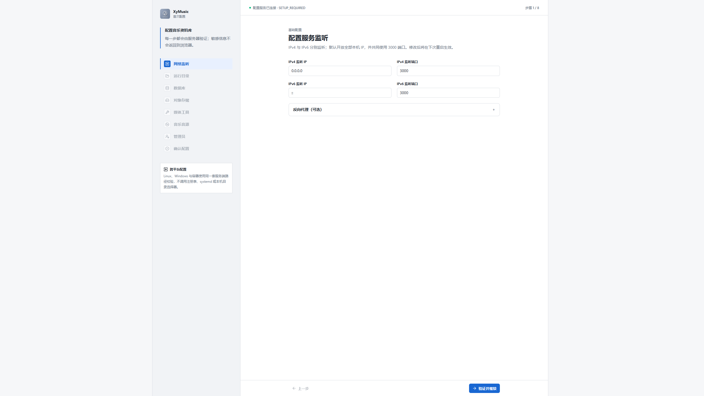
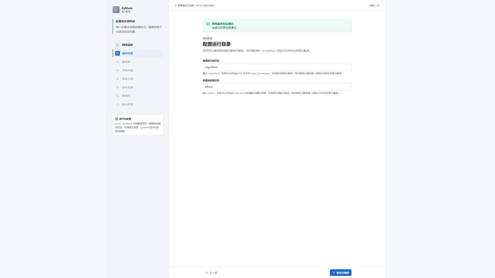
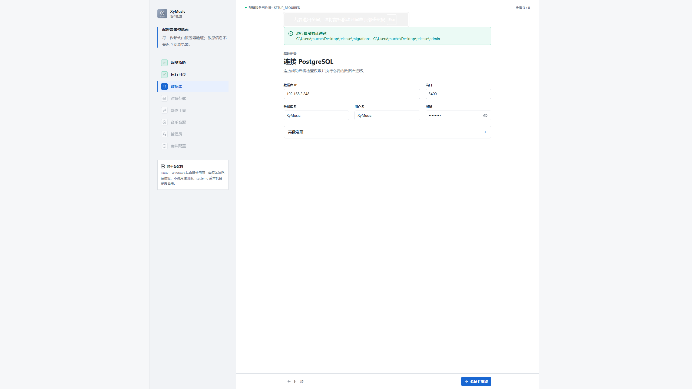
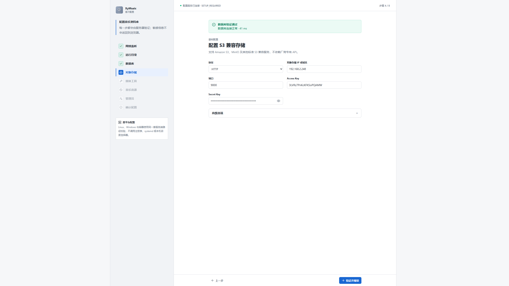
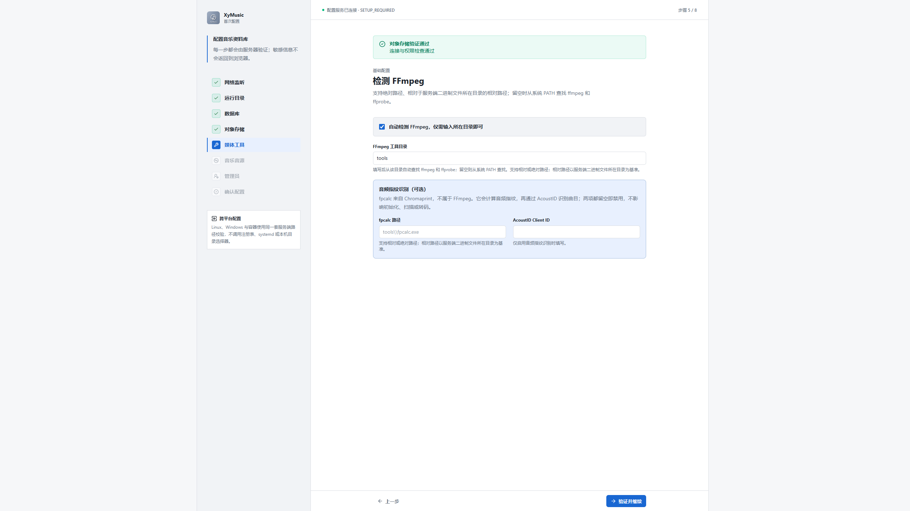
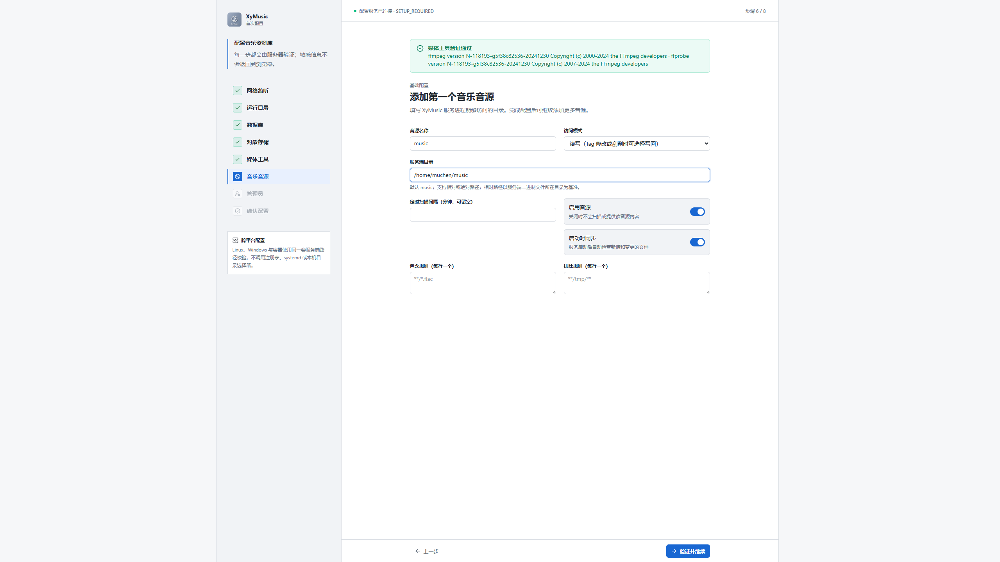
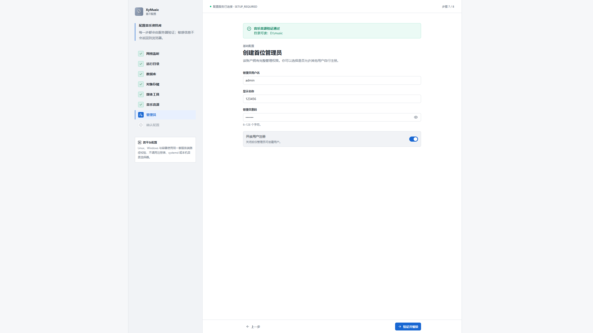
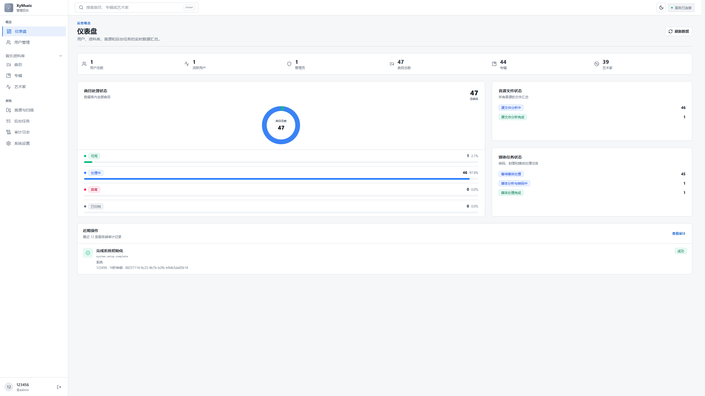
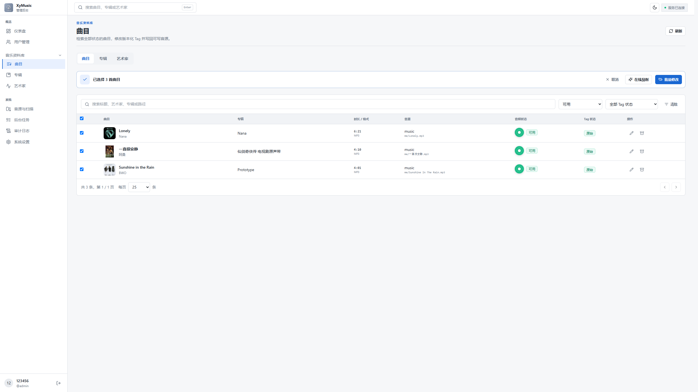
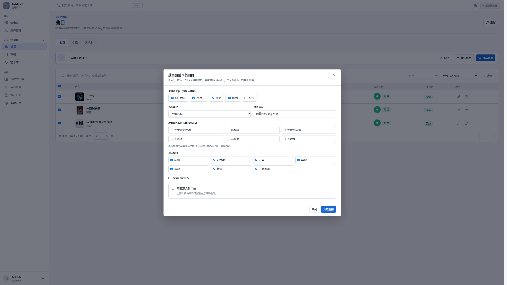

# 首先我们执行命令 
```bash
curl -fsSL https://github.com/muchenspace/XyMusic/raw/main/install.sh | sudo bash
```
## 等待片刻，浏览器访问你部署设备的IP:PORT
# 1.不出意外，你会看到此页面,这一步如无特殊需求，保持默认点击下一步即可

# 2.同上，无特殊需求，点击下一步

# 3.这一步填写你postgreSql数据库的连接信息

# 4.这一步填写对象存储的连接信息

# 5.这一步无特殊需求保持默认即可

# 6.这一步是设置音源名称以及路径，访问模式建议读写，这样可以进行回写tag，也就是把刮削到的信息不仅仅存在数据库，也可以回写到源文件

# 7.创建首位管理员

# 8.不出意外会跳转到登录页面，登录完成之后就会来到主页，等待音源全部转码处理完毕，点击曲目页面，开始批量刮削，刮削完成之后就可以打开客户端进行连接，然后进行愉快的听歌了！


